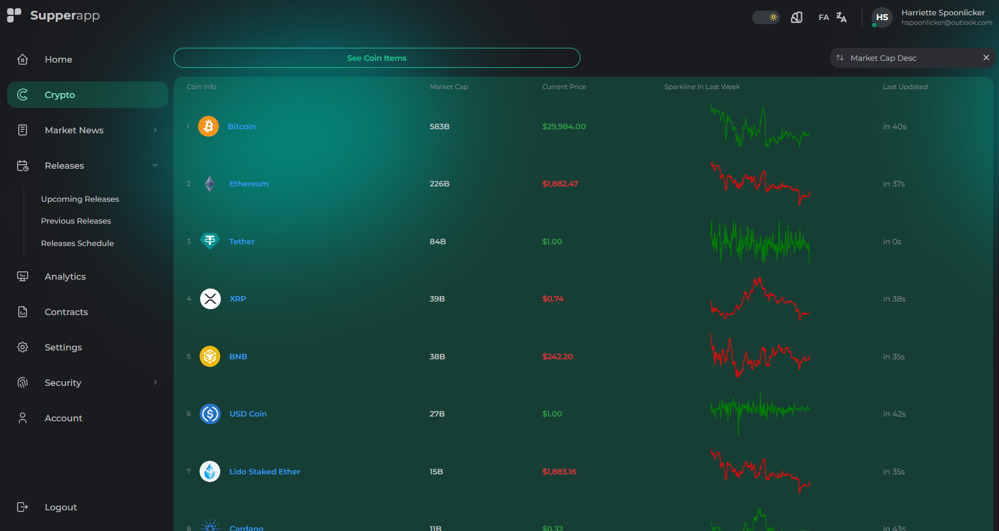

# Supper App React

This Layout made with React, Mantine UI(with Tabler Icons and other depencies), Styled Components, TypeScript, react-i18next, d3, Tailwind and Postcss.

## [Demo Link](https://supper-app-react.netlify.app)



## Tech Stack

**Client:** React, Mantine UI, Styled Componet, D3.js, Tanstack Table, Tabler Icon, Axios, React i18next, React Content Loader, React Helmet Async, React Router Dom, SVGR, TailwindCSS, Postcss and Stylis.

## Features

- Pnpm, Vite
- Eslint, Prettier, Stylelint Husky and Lint-staged
- Git flow
- Netlify

## Run Locally

Clone the project

```bash
  git clone https://github.com/AliBagheri2079/supper-app-react.git
```

Go to the project directory

```bash
  cd supper-app-react
```

Install dependencies

```bash
  pnpm install
```

Start the server

```bash
  pnpm run dev
```

Format the Component

```bash
  pnpm run format
```

linting the Component

```bash
  pnpm run lint
```

## Deployment

To deploy this project run

```bash
  pnpm run deploy
```

## 🚀 About Me

I'm Ali Bagheri. Learning about 3 years on Frontend Development Position ...

## 🔗 Links

[](https://github.com/AliBagheri2079)

[](https://www.linkedin.com/in/alibagheri2079/)

[](https://twitter.com/AliBagheri2079)
