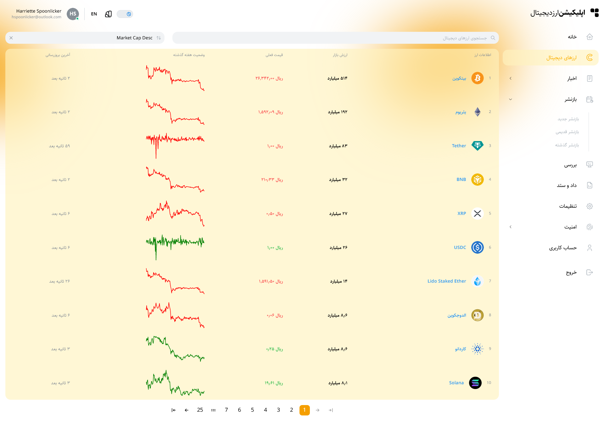
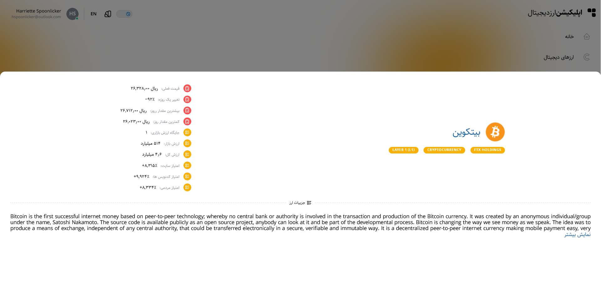
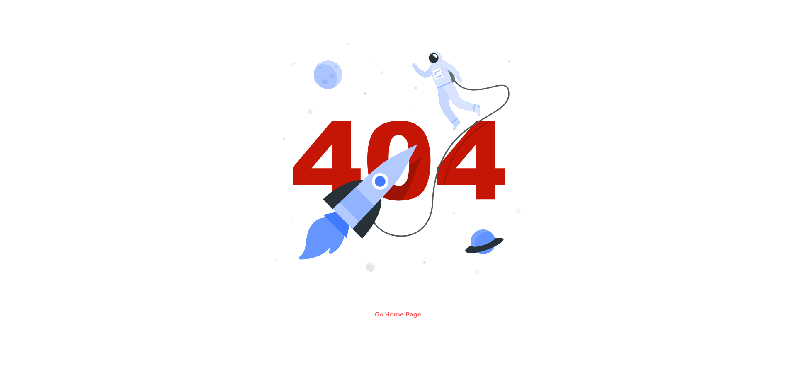
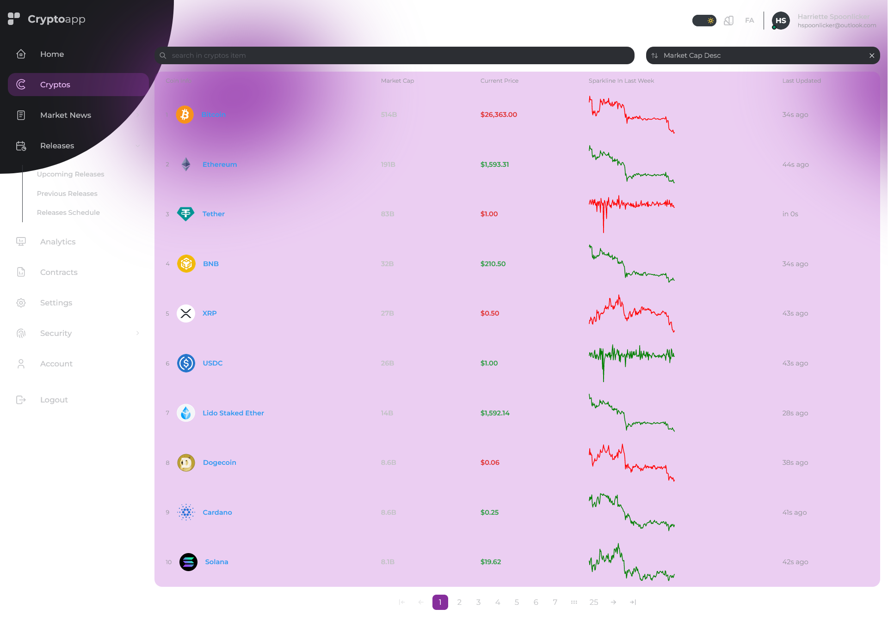
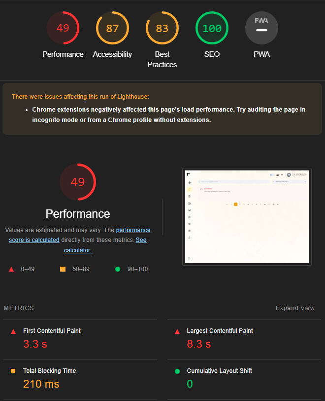

# Crypto React

This Layout made with React, Mantine UI(with Tabler Icons and other depencies), TypeScript, Zustand, SWR, React i18next, React Helmet Async, Axios, D3, Tailwind and Postcss.

## [Demo Link](https://cryptos-app-react.netlify.app/)












## Tech Stack

**Client:** React, Mantine UI, Styled Componet, Zustand, SWR, D3.js, Tanstack Table, Tabler Icon, Axios, React i18next, React Content Loader, React Lazy Load Image, React Helmet Async, React Error Boundary, React Router Dom, SVGR, Clsx, TailwindCSS, Postcss and Stylis.

**Config** Pnpm, Vite, Eslint, Prettier, Stylelint Husky and Lint-staged, Git flow and Netlify

## Features

- English and Persian Language Support
- Multiple Theme Colors
- Toggle Background Curvely
- Three Type Navlinks
- Cryptos Table with Pagination, Search, Sort, Placeholder and Error Components
- Coin Drawer with Placeholder and Error Components
- Cryptos and Coin Page Supported Persian Language with Coingecko Api
- Many Reusable Hooks
- Dashboard Layout
- Loader Wrapper with Suspense and Eroor Boundary
- Notfound and Redirect status Page
- Custom Title For Every Pages
- Create Multiple coingecko Services
- Create Zustand Cryptos Store
- Create Swr Coin Store
- Multile Types for Api and Components Pros
- Many Utility Constants
- Multiple Utility Helpers
- Add Many Env Options

## Run Locally

Clone the project

```bash
  git clone https://github.com/AliBagheri2079/crypto-react.git


```

Go to the project directory

```bash
  cd crypto-react


```

Install dependencies

```bash
  pnpm install


```

Start the server

```bash
  pnpm run dev


```

Format the Component

```bash
  pnpm run format


```

linting the Component

```bash
  pnpm run lint


```

## Deployment

To deploy this project run

```bash
  pnpm run deploy


```

## 🚀 About Me

I'm Ali Bagheri. Learning about 3 years on Frontend Development Position ...

## 🔗 Links

[](https://github.com/AliBagheri2079)

[](https://www.linkedin.com/in/alibagheri2079/)

[](https://twitter.com/AliBagheri2079)
